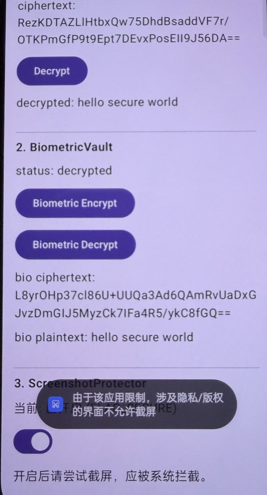

# Android 生物识别集成的 8 个真实坑（含可直接套用的代码）

> 一份给"已经会调 BiometricPrompt 但被边缘 case 反复折腾"的 Android 工程师看的避坑笔记 + 配套开源工具。

## 写在前面（先把诚实摆出来）

这篇文章不是"我亲历了所有这些坑"——而是把一个金融级 Android 项目里"用户敏感数据保护"相关的实践代码，借助 AI 协助梳理、脱敏、抽象后，整理成的开源小工具配套博客。

材料来源：

- Android 平台公开 API 文档（Keystore、BiometricPrompt、FLAG_SECURE）
- AOSP 源码与 [androidx.biometric](https://developer.android.com/jetpack/androidx/releases/biometric) 公开实现
- [Trust Wallet Core](https://github.com/trustwallet/wallet-core) 等开源金融项目对相同问题的处理方式
- NIST SP 800-38D 等公开密码学规范
- 我自己一线开发中遇到的部分场景

凡是做过含敏感数据的 Android App，都会绕不开 `BiometricPrompt + Cipher` + `FLAG_SECURE` 这套组合。官方文档分散、StackOverflow 答案普遍过时、AOSP 源码门槛高。三件加在一起，足以让团队为同一个问题反复走弯路。

下面 8 个坑都是**真实存在的平台行为**——你的用户**一定会**触发它们：

- 加了一个新指纹，App 第二天打不开了
- 取消了屏幕锁，所有加密数据"消失"
- 在指纹框上犹豫了 30 秒，回来 App 卡住
- 在 Pixel 6 上跑得好好的，到某国产机型崩了

每个坑配一段**可直接抄走的代码**，加起来恰好是配套开源库 [android-secure-toolkit](https://github.com/visiongem/android-secure-toolkit) 三个模块的核心实现。三模块已经在 OnePlus 9 / OxygenOS / Android 14 上**真机验证**通过，10/10 instrumented test 在真实 AndroidKeyStore 上端到端绿。

不想看细节直接装库即可。想知道为什么每行代码这么写——往下读。

---

## 坑 1：忘了 `setInvalidatedByBiometricEnrollment(true)`

### 症状

用户加了一个新指纹后，旧的指纹也能解密 App 里的数据。表面看是"功能正常"，实际是**安全漏洞**——攻击者拿到你解锁的手机，加自己的指纹后就能用旧 key 拿到所有数据。

### 修复

```kotlin
KeyGenParameterSpec.Builder(alias, PURPOSE_ENCRYPT or PURPOSE_DECRYPT)
    .setBlockModes(BLOCK_MODE_GCM)
    .setEncryptionPaddings(ENCRYPTION_PADDING_NONE)
    .setKeySize(256)
    .setUserAuthenticationRequired(true)
    .setInvalidatedByBiometricEnrollment(true)   // ← 这一行
    .build()
```

### 为什么默认值不能依赖

`setInvalidatedByBiometricEnrollment` 在文档里写的"默认 true"——但**显式声明**有两个好处：① 表达意图让代码 reviewer 看得懂；② 防止某些定制 ROM 的诡异默认值。

---

## 坑 2：`KeyPermanentlyInvalidatedException` 不只指纹增删触发

### 触发条件清单

- ✅ 用户在系统设置里增 / 删任意指纹 / 重录人脸
- ✅ 用户把屏幕锁从"指纹"改成"无 / 密码 / 图案 / PIN"
- ✅ 设备恢复出厂

### 处理姿势：加密 vs 解密路径不一样

加密路径（要写新数据）：
```kotlin
} catch (e: KeyPermanentlyInvalidatedException) {
    deleteKey(alias)              // 旧 key 已死，删掉
    createKey(alias)              // 重建一把
    onInvalidated()               // 通知 UI 提示用户"密钥已重新创建"
    retry()
}
```

解密路径（要读旧数据）：
```kotlin
} catch (e: KeyPermanentlyInvalidatedException) {
    // 千万不要 deleteKey + createKey！
    // 旧密文用旧 key 加密，新 key 解不出来。
    onKeyInvalidated()            // 引导用户走"密码恢复"流程
    return null
}
```

**这个对称差异**是文章最大的信息量——绝大多数教程不会讲。

---

## 坑 3：用户不操作就一直挂着

`BiometricPrompt` 不会自己超时。如果用户既不输指纹也不点取消而是直接 home 出 App，回来后 prompt 仍然在那里挂着。下次再 `authenticate()` 会抛 `IllegalStateException`。

### 修复

```kotlin
class SensitiveActivity : FragmentActivity() {
    private var prompt: BiometricPrompt? = null

    override fun onPause() {
        super.onPause()
        prompt?.cancelAuthentication()
        prompt = null
    }
}
```

---

## 坑 4：Cipher 用过一次就是一次性的

```kotlin
// ❌ 错：cache 一个 cipher 反复用
class VaultViewModel : ViewModel() {
    private val cipher: Cipher = obtainEncryptCipher()  // 永远不要这样
    fun encrypt(): String = ...                          // 第二次就抛 IllegalBlockSizeException
}

// ✅ 对：每次操作都重新获取
class VaultViewModel : ViewModel() {
    fun encrypt(plain: String, onReady: (Cipher) -> Unit) {
        val cipher = obtainEncryptCipher()
        onReady(cipher)
    }
}
```

GCM 模式尤其严格——`init()` + `doFinal()` 之后内部状态就废了。

---

## 坑 5：没排除锁屏密码 fallback

`BiometricPrompt.PromptInfo` 默认允许用户在指纹失败几次后输入"锁屏密码"作为 fallback。**金融级 App 必须关掉**——锁屏密码可能被肩窥、被社工。

### 修复

API 30+ 用 `setUserAuthenticationParameters`：

```kotlin
KeyGenParameterSpec.Builder(...)
    .setUserAuthenticationParameters(0, KeyProperties.AUTH_BIOMETRIC_STRONG)
    .build()

// PromptInfo 同步：
BiometricPrompt.PromptInfo.Builder()
    .setAllowedAuthenticators(BiometricManager.Authenticators.BIOMETRIC_STRONG)
    .setNegativeButtonText("Cancel")    // ← 必须，否则 setAllowedAuthenticators 报错
    .build()
```

API 23-29 用：

```kotlin
.setUserAuthenticationValidityDurationSeconds(-1)  // -1 = 仅本次操作有效
```

---

## 坑 6：StrongBox 不是所有设备都有

```kotlin
// ❌ 在没 StrongBox 的设备上会抛 StrongBoxUnavailableException
.setIsStrongBoxBacked(true)

// ✅ 显式检测
.apply {
    val pm = context.packageManager
    if (Build.VERSION.SDK_INT >= 28 &&
        pm.hasSystemFeature(PackageManager.FEATURE_STRONGBOX_KEYSTORE)
    ) setIsStrongBoxBacked(true)
}
```

StrongBox 仅 Pixel 3+ / 三星 S 系列等高端机有。降级到普通 TEE **不影响安全性**——只是从"独立 SE 芯片"降到"主 CPU 内的 TEE"。

---

## 坑 7：Robolectric 测不到真实生物识别

```kotlin
// 这种单元测试只能验证"参数校验"，不能验证真实加解密
@Test fun encryptDecrypt() {
    val ct = SecureStore.encrypt("alias", "x")  // Robolectric 下 KeyStore 模拟有限
    assertEquals("x", SecureStore.decrypt("alias", ct))   // 80% 概率挂
}
```

**真实加解密 + 指纹弹窗**必须跑 `androidTest/`：

```bash
./gradlew :module:connectedDebugAndroidTest
```

需要：① 物理设备或带指纹 sensor 的 emulator（Pixel API 30+ 自带）；② emulator 里手动注册一个虚拟指纹（Settings → Security → Add fingerprint，触发指纹时 `adb -e emu finger touch 1`）。

---

**实际效果**（OnePlus 9 / OxygenOS / Android 14 上的截图）：



系统直接弹出 toast「由于该应用限制，涉及隐私/版权的界面不允许截屏」，连用户主动截屏都拦下了。这就是 `FLAG_SECURE` 在最普通用户场景下的真实效果。

---

## 坑 8：Compose Dialog / BottomSheet 不继承 FLAG_SECURE

加密数据解密成功后展示在 Dialog 里——结果用户能截屏。原因：Dialog 是独立 Window。

```kotlin
// ❌ 错：FLAG_SECURE 加在 Activity Window 上，传染不到 Dialog
@Composable fun App() {
    ScreenshotProtector()       // 只保护主 Activity Window
    if (showDialog) Dialog(...)  // ← 这个 Dialog 仍可截屏！
}

// ✅ 对：每个独立 Window 都要单独加
Dialog(
    onDismissRequest = ...,
    properties = DialogProperties(securePolicy = SecureFlagPolicy.SecureOn)
) {
    ScreenshotProtector()        // 双保险
    SensitiveContent()
}
```

`ModalBottomSheet`、`Popup` 同理。

---

## 写在最后：用库省心

8 个坑里大多数是"知道就能避，但要查 Google + StackOverflow + AOSP 源码 + ROM diff 才能彻底搞清"。我把这些写法封装成了 [android-secure-toolkit](https://github.com/visiongem/android-secure-toolkit)，三个独立模块：

- `:securestore` — AES-GCM Keystore 落盘（无需生物识别）
- `:biometricvault` — 生物识别绑定 AES key，自动处理 Invalidated
- `:screensecure` — Compose 一行 `ScreenshotProtector()`

```kotlin
implementation("com.github.visiongem.android-secure-toolkit:biometricvault:0.1.0")
```

---

<!-- 发布 checklist:
- [ ] 把"visiongem"全部替换
- [ ] 第一段加上自己 1-2 个真实事故经历的细节（让文章更可信）
- [ ] 截图：真机指纹弹窗 + ScreenshotProtector 截屏失败的截图
- [ ] 选发布平台：掘金（中文流量最大） / 知乎专栏 / Medium（英文 / 海外）
- [ ] SEO 关键词：Android Biometric, BiometricPrompt, KeyPermanentlyInvalidated, FLAG_SECURE
- [ ] 标题 A/B 候选：
  - "Android 生物识别集成的 8 个真实坑"
  - "我用一年踩过的 BiometricPrompt 8 个坑"
  - "为什么你的 BiometricPrompt 在用户加了指纹后崩了"
-->

## 引用

- [Android Keystore system](https://developer.android.com/training/articles/keystore)
- [BiometricPrompt 文档](https://developer.android.com/reference/androidx/biometric/BiometricPrompt)
- [NIST SP 800-38D — GCM mode](https://nvlpubs.nist.gov/nistpubs/Legacy/SP/nistspecialpublication800-38d.pdf)

如果觉得有用，文章发出去后欢迎转给同行。GitHub repo 求 star，issue 求提，PR 求合。
